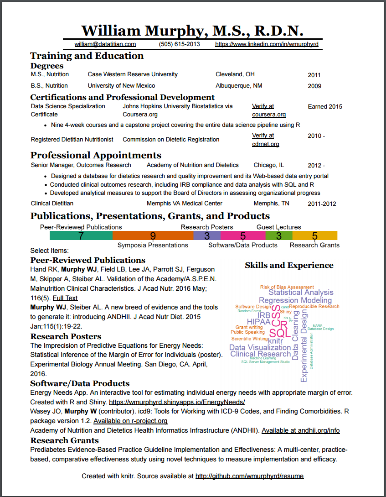

# Data Science Resume
This project generates a resume document from data in a csv file using knitr. At present, it is designed to be knit into HTML and then converted to PDF with Google Chrome's print to PDF function. Doing this instead of knitting direct to PDF with pandoc allows me to customize of the appearance with CSS. 

The R markdown code can generate the following types of sections:

1. Tabular resume data with any organization of headings and optional subheadings, and optional descriptive text to display underneath any table row (markdown lists, links, et c. supported). 
2. A single section of descriptive text entries with the option to save space by displaying a summary bar chart with the counts for each subgroup and listing only priority items in full.
3. A wordcloud that floats on the right side of the descriptive text section. 

An example with all three sections that uses the summary feature is pictured below:

The R markdown code reads data from 2 csv files:

1. contact.csv: up to three entries in the first row of a csv file to be displayed below the document title (name)
2. resume-data.csv: data for the resume body in 9 columns (with header row) as described below

Column | Description
--- | ---
group | First level section headers 
subgroup | Second-level section headers (optional)
title | e.g. job title or degree for tables or words for display in wordclouds
desc | Additional descriptive column for tables
loc | Location column for tables
text | The text for descriptive text entries or optional descriptive text for table rows, displayed below row using the full width of the table. Markdown syntax supported, including lists and links. Use \\n for newlines.
date | One or more 4 digit years (e.g. 2004 - 2008) used for sorting and date column display for tables (additional text OK). Sorting date for text entries in the form of yyyy/mm/dd (not displayed)
priority | Determine which entries to display for tables and text: leave all blank for a subgroup to display all entries, mark some entries as numbers > 0 to display those and hide the rest, mark all entries 0 to completely omit a subgroup or group. For wordclouds, the relative size of the words in the clouds. 
type | Entry display type. One of: table, text, wordcloud. 

A simpler and more flexible version is available in the "simpler" branch. Wordcloud support is not included, but there can be any number of tables and text sections in any order with summary charts available for any group. This works by looping over the csv file and generating the output using single code chunk, but wordcloud support required that it be split up into separate chunks in order to accomodate the different image sizes for the summary chart and the wordcloud.
